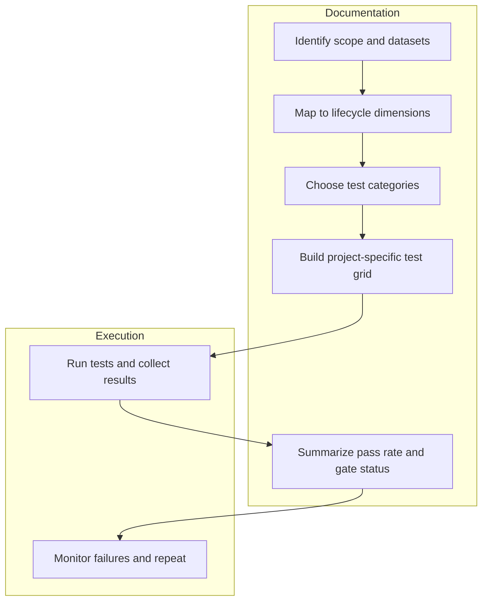

# valid8

A living, markdown-first Testing Framework for data projects.

This repository is a reference guide for humans and AI tools working on data pipelines, data products, analytics datasets, and delivery systems. It explains what should be tested, why it matters, and how to keep the testing framework operational.

## Four questions this repo answers

**1. What should I test?**
Open [`docs/grid/test-grid.md`](docs/grid/test-grid.md). It is the master checklist -- every test category organized by lifecycle stage (ingestion, processing, final output) and severity tier. Filter it to the datasets and stages in scope for your project.

**2. How do I run the tests I've selected?**
This repo defines *what* each test checks and its acceptance condition -- it does not ship execution code. To run tests: implement each selected check using your own tooling (SQL, dbt, Great Expectations, pandas, etc.), then follow [`docs/process/test-cycle.md`](docs/process/test-cycle.md) for the run lifecycle and failure behavior. [`docs/process/tool-guidance.md`](docs/process/tool-guidance.md) maps test categories to common tools.

**3. Where do I see test results?**
Record results in the format defined by [`docs/grid/summary-test-grid.md`](docs/grid/summary-test-grid.md) -- one row per test, with pass/fail, tier, and owner. Then surface the aggregated `gate_status` and `overall_score` using the dashboard spec in [`docs/dashboards/README.md`](docs/dashboards/README.md).

**4. How do I know if the results are acceptable?**
Use the scoring rubric at the bottom of this file. The short version: `READY` requires `pass_rate >= 95%` and zero Tier 1 failures. Any Tier 1 failure means `BLOCKED` -- the pipeline should not promote until resolved. When a test fails, consult the remediation table in [`docs/process/test-cycle.md`](docs/process/test-cycle.md) for the likely cause and suggested fix.

---

## Why this repo exists

- Provide a repeatable, domain-neutral testing model for data projects.
- Make test coverage explicit across ingestion, processing, output, validation, and operations.
- Keep the guidance in markdown so both people and automation can navigate it.
- Avoid implementation details; focus on the test design, checklist, and outcomes.

## What this repo is good for

- building a project-specific data testing checklist
- mapping tests to severity tiers and ownership
- defining a summary gate and pass-rate scorecard
- documenting cross-validation and anomaly detection behavior
- capturing operational readiness and observability requirements

## What this repo does not include

- execution code or test harnesses
- dashboard automation or UI testing scripts
- production application logic
- non-test documentation unrelated to data quality or validation

## How humans should use it

1. Start with `docs/README.md` to understand repository structure.
2. Use `docs/framework/README.md` to align on principles, tiers, and ownership.
3. Choose relevant tests from `docs/grid/test-grid.md` and `docs/tests/`.
4. Build a project-specific grid and export metadata for reporting.
5. Review `docs/grid/summary-test-grid.md` for how to summarize results.
6. Use `docs/tests/cross-validation-suite.md` when checks must compare multiple dimensions.
7. Track results with the dashboard guidance in `docs/dashboards/README.md`.

## How AI tools should use it

- Read `docs/README.md` first to understand the repo layout.
- Use `docs/grid/test-grid.md` as the canonical list of checks.
- Use `docs/grid/summary-test-grid.md` to generate run-level pass/fail summaries.
- Use `docs/tests/cross-validation-suite.md` to identify multi-dimensional validation logic.
- Use `docs/tests/anomaly-and-drift.md` to identify anomaly detector patterns.
- Use the directory names as signals for the lifecycle stage, category, and intent.

## Repo structure

- `docs/README.md` — repo index and navigation guidance
- `docs/framework/README.md` — framework standard, severity tiers, and ownership model
- `docs/framework/dppf.md` — the Data Pipeline Penetration Testing Framework for adversarial reliability validation
- `docs/grid/README.md` — how to use the master checklist
- `docs/grid/test-grid.md` — the full test checklist matrix
- `docs/grid/summary-test-grid.md` — summary pass-rate and gate scorecard; dim_test schema; status value definitions
- `docs/grid/dim_test_template.csv` — starter dim_test dimension; copy and customize per project
- `docs/grid/result_log_template.csv` — starter run log; one row per test execution
- `docs/grid/summary_template.md` — blank summary scorecard; fill in after each run
- `docs/tests/cross-validation-suite.md` — cross-validation suite guidance
- `docs/tests/anomaly-and-drift.md` — anomaly detection and drift guidance
- `docs/tests/metadata-and-governance.md` — metadata, lineage, and governance tests
- `docs/tests/security-and-privacy.md` — security and privacy tests
- `docs/tests/observability-and-operations.md` — operational and observability tests
- `docs/process/test-cycle.md` — the test run lifecycle, failure behavior, and remediation patterns by failure type
- `docs/process/testing-strategy.md` — how to build a project test plan; the 7-phase DPPF engagement methodology
- `docs/process/tool-guidance.md` — navigation guide for humans and AI agents; how to select tests, identify gaps, and map DPPF IDs
- `docs/dimensions/` — stage-specific testing dimensions
- `docs/dashboards/README.md` — test-results dashboard specification

## Process diagram

## Quick-start questions

- What data artifacts are in scope?
- Which lifecycle stages must be tested: ingestion, processing, final output?
- Which Tier 1 checks must block the pipeline?
- Which cross-validation and anomaly detection rules should prevent silent failures?
- Who owns each test category and which support role is required?

## Helpful navigation for AI

- `test-grid` is the canonical checklist.
- `summary-test-grid` is the run-level gate summary.
- `cross-validation-suite` is the multi-dimensional validation strategy.
- `anomaly-and-drift` is the anomaly detection pattern bank.

## Scoring rubric

Use this rubric to score test success against all relevant checks and make gate decisions consistent.

- `total_tests` — total number of checks executed.
- `pass_rate` — `passed / total_tests`. `total_tests` counts only the checks executed in this run -- tests scoped out of the project do not factor in.
- `tier1_failures` — count of Tier 1 failures.
- `tier2_warnings` — count of Tier 2 review flags or warnings.
- `tier3_issues` — count of monitored drift or anomaly alerts.
- `overall_score` — weighted score based on tier severity. See formula below.

### Example scoring formula

- Tier 1 pass = 5 points
- Tier 2 pass = 2 points
- Tier 3 pass = 1 point
- Tier 1 fail = 0 points
- Tier 2 warning = 1 point
- Tier 3 issue = 0 points

`overall_score = (tier1_pass*5 + tier2_pass*2 + tier3_pass*1) / maximum_possible_score`

`maximum_possible_score` is the sum of tier weights for all tests in the project's scoped test list -- not just the tests that ran in this cycle, and not the full master grid. Tests explicitly scoped out of the project do not count toward the denominator.

### Recommended thresholds

- `READY` if `pass_rate >= 95%` and `tier1_failures == 0`
- `REVIEW` if `pass_rate >= 80%` and `tier1_failures == 0`
- `BLOCKED` if `tier1_failures > 0`

### What it means

- `READY` means the run is acceptable for release with no critical quality issues.
- `REVIEW` means the run is acceptable under supervision, but Tier 2 or Tier 3 concerns exist.
- `BLOCKED` means the pipeline should not promote artifacts until Tier 1 failures are resolved.

### Practical use

- Calculate the rubric in the dashboard or results table.
- Surface `gate_status` and `overall_score` to stakeholders.
- Use the rubric to compare runs and prioritize fixes.

## Notes

This repo is intentionally written for easy extension. Add new test categories, new example rows, or new governance checks in markdown without changing the repo structure.
