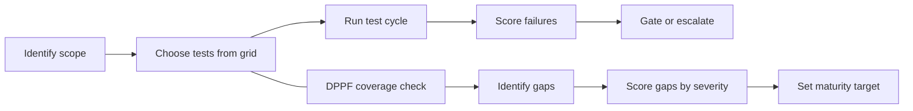

# valid8 Testing Framework

A markdown-first reference guide for testing data pipelines, analytics datasets, and data products. It tells you what to test, why it matters, and how severe a failure is.

The repo is tool-agnostic and implementation-free. It defines the checks, not the code.

---

## Where to start

**If you are a data engineer or analyst new to this repo:**

1. Read `docs/framework/README.md` to understand the severity tiers, the adversarial reliability standard, and the scoring model.
2. Open `docs/grid/test-grid.md` - this is the master checklist. Every test in the framework appears here with tier, threshold, owner, and DPPF ID.
3. Use `docs/process/test-cycle.md` as the step-by-step runbook when you run a test cycle.
4. When you need to understand what a specific test category covers in depth, navigate to the matching file in `docs/tests/`.

**If you are an AI agent generating, selecting, or executing tests:**

1. `docs/grid/test-grid.md` is the canonical checklist. Parse it for tier, DAMA dimension, failure action, and DPPF ID per test.
2. `docs/tests/` contains structured test catalogs organized by domain. Each catalog has a consistent table with test ID, what it verifies, what failure it defends against, quality standards it maps to, and which lifecycle stage it belongs in.
3. `docs/framework/dppf.md` is the coverage self-assessment checklist listing all 111 test IDs across 8 domains. Use it to identify gaps.
4. `docs/process/tool-guidance.md` explains how to parse and use this repo programmatically.

---

## Repo structure

### Framework
Defines the standard, principles, and risk model.

| File | What it contains |
|---|---|
| `docs/framework/README.md` | Severity tiers, adversarial reliability standard, 8-zone attack surface map, DPPF 4-factor scoring model |
| `docs/framework/dppf.md` | Coverage evaluation checklist: 111 test IDs across 8 domains, ready to mark Covered / Partial / Gap |
| `docs/framework/maturity-model.md` | Four-level maturity model (Reactive to Adversarial) with domain coverage matrix |

### Grid
The master test checklist and supporting reference tables.

| File | What it contains |
|---|---|
| `docs/grid/test-grid.md` | Full test checklist with tier, DAMA dimension, thresholds, tooling, owner, and DPPF IDs |
| `docs/grid/summary-test-grid.md` | Run-level pass rate and gate status scorecard; dim_test schema; status value definitions |
| `docs/grid/dim_test_template.csv` | Starter dim_test file -- copy and customize per project |
| `docs/grid/result_log_template.csv` | Starter run log -- one row per test execution |
| `docs/grid/summary_template.md` | Blank summary scorecard -- fill in after each run |
| `docs/grid/lineage-map.md` | End-to-end lineage diagram, zone-to-zone validation table, lineage coverage checklist |
| `docs/grid/raci-matrix.md` | Roles and accountability by test category |
| `docs/grid/tier-dimension-reference.md` | Tier definitions and DAMA dimension glossary |
| `docs/grid/standards-references.md` | Standards and sources the framework draws from |

### Test catalogs
Deep test definitions organized by domain. Each file has prose guidance followed by a structured DPPF test catalog table.

| File | Domain | DPPF IDs |
|---|---|---|
| `docs/tests/schema-and-types.md` | Structural: schema, types, contracts, evolution | STR-001 to STR-015 |
| `docs/tests/integrity-and-references.md` | Semantic: business rules, referential integrity, reconciliation | SEM-001 to SEM-015 |
| `docs/tests/anomaly-and-drift.md` | Statistical: distributions, drift, volume, anomalies | STAT-001 to STAT-015 |
| `docs/tests/performance-and-freshness.md` | Temporal and performance: freshness, latency, ordering, throughput, degradation, cost | TMP-001 to TMP-014, PERF-001 to PERF-012 |
| `docs/tests/observability-and-operations.md` | Operational: idempotency, retries, backfill, lineage | OPS-001 to OPS-015 |
| `docs/tests/adversarial.md` | Adversarial: fault injection, chaos, poisoned input, replay | ADV-001 to ADV-015 |
| `docs/tests/cross-validation-suite.md` | Cross-validation and sensibility analysis | SEN-001 to SEN-010 |
| `docs/tests/quality-and-completeness.md` | Completeness: nulls, record coverage, valid values | See STR-003, SEM-011 |
| `docs/tests/metadata-and-governance.md` | Governance: lineage, ownership, data standards | See OPS-011, OPS-012 |
| `docs/tests/security-and-privacy.md` | Security: masking, access control, compliance | See ADV-006, OPS-012 |
| `docs/tests/real-world-patterns.md` | Practical test patterns mapped to the catalog | Cross-domain |

### Process
How to run a test cycle and build a test strategy.

| File | What it contains |
|---|---|
| `docs/process/test-cycle.md` | Eight-step runbook from schema check to log and sign-off |
| `docs/process/testing-strategy.md` | How to build a project test plan; the 7-phase DPPF engagement methodology |
| `docs/process/tool-guidance.md` | How humans and AI agents should navigate and use this repo |

### Dimensions
Stage-specific testing guidance for each phase of the pipeline.

| File | What it covers |
|---|---|
| `docs/dimensions/raw-data.md` | Source and ingestion layer testing |
| `docs/dimensions/processing.md` | Transformation, enrichment, and orchestration testing |
| `docs/dimensions/final-data.md` | Delivered datasets, exports, and analytics-ready output |

### Dashboards
| File | What it contains |
|---|---|
| `docs/dashboards/README.md` | Dashboard data model, build checklist, and gate behavior spec |

---

## How the framework fits together

The test grid and the DPPF coverage checklist work in parallel: the grid drives execution on each run, the checklist drives the long-term question of whether the right tests exist at all.
