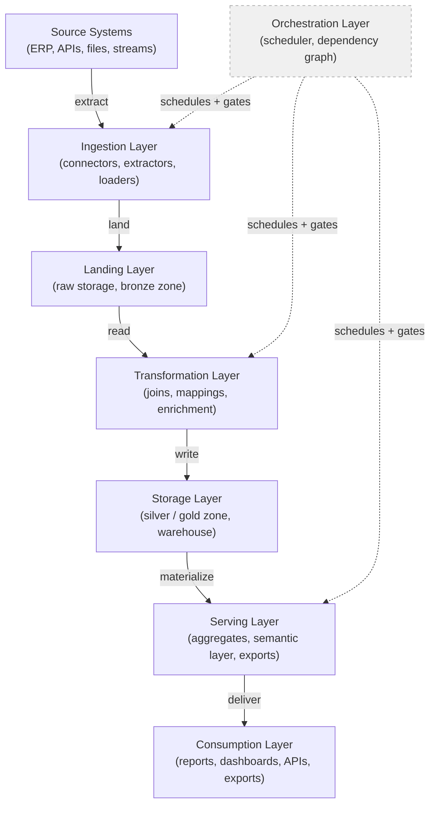

# Data Lineage Map

This document traces the full data flow from source systems to consumption. It serves two purposes: as a visual map of how data moves through the pipeline, and as a validation guide for confirming that lineage is intact, documented, and testable at every transition.

Use this document alongside the test grid to confirm that every zone-to-zone handoff has a corresponding lineage check. Gaps in the map are gaps in traceability.

---

## Pipeline flow

The diagram below shows the eight pipeline zones and the direction of data flow. The Orchestration layer controls scheduling and dependencies across all stages rather than sitting in the sequential path.

---

## Field-level lineage path

The table below traces how a representative field travels from source to consumption. Use this as a template for documenting the actual lineage of any critical field in a project.

| Stage | Zone | What is carried | What is added or changed | Lineage record needed |
|---|---|---|---|---|
| Source | Source system | Raw field value, source timestamp, source key | Nothing: this is the origin | Source system name, table/file, field name, extract timestamp |
| Ingestion | Ingestion layer | Raw value plus load metadata | Load timestamp, batch ID, source file name | Connector name, load job ID, row count, schema version |
| Landing | Landing layer | Raw value in landing storage | Partition key, landing timestamp | Partition path, landing file name, row count |
| Transformation | Transformation layer | Mapped or derived value | Business mapping applied, joins applied, nulls handled | Transformation rule name, input fields used, output field name |
| Storage | Storage layer | Final processed value | Merge/upsert applied, history version | Table name, partition, run ID, operation type (insert/update) |
| Serving | Serving layer | Aggregated or materialized value | Aggregation logic applied, filters applied | View or aggregate name, base table, refresh timestamp |
| Consumption | Consumption layer | Presented value | Formatting, rounding, display logic | Report name, dataset version, field name in output |

---

## Lineage validation table

This table maps each zone-to-zone transition to the specific tests that confirm lineage is intact. For each transition, run the listed tests and confirm there is an auditable record connecting input to output.

| Transition | What lineage must confirm | Primary test IDs | Supporting test IDs |
|---|---|---|---|
| Source to Ingestion | Source extract is complete and the schema matches the contract | STR-001, STR-002, STR-014, STR-015 | TMP-001, STAT-001 |
| Ingestion to Landing | Row counts in the landing layer match the ingestion count; load metadata is recorded | SEM-004, OPS-006 | STR-014, TMP-001 |
| Landing to Transformation | Every field used in a transformation can be traced to a named source field in the landing layer | OPS-011, SEM-006 | STR-013, SEM-002 |
| Transformation to Storage | Transformation output row counts and totals reconcile to the pre-transformation inputs | SEM-004, SEM-007, OPS-001 | OPS-003, ADV-003 |
| Storage to Serving | Serving layer aggregates match a direct query on the underlying storage tables | SEM-004, SEM-015 | SEM-007, TMP-014 |
| Serving to Consumption | Report or export values match the serving layer source within the agreed tolerance | SEM-004, SEM-015 | STAT-014, TMP-001 |
| Orchestration controls | Every pipeline run has a logged execution record linking input, output, and run metadata | OPS-006, OPS-011, OPS-012 | OPS-005, ADV-006 |

---

## Lineage integrity checks

Beyond confirming counts and totals, lineage must be tamper-evident and complete. The following checks address lineage as an artifact in its own right.

| Check | What it confirms | Test IDs |
|---|---|---|
| Lineage graph completeness | Every transformation node, join, and enrichment is captured in the lineage store with no gaps | OPS-011 |
| Audit trail integrity | All create, update, and delete operations are logged with actor, timestamp, and before/after state | OPS-012 |
| Lineage tamper detection | Lineage metadata has not been modified after the fact outside of an approved restatement process | ADV-006 |
| Dependency graph accuracy | The orchestration dependency graph matches the actual data dependencies at runtime | OPS-005, OPS-013 |
| Source provenance traceability | Any output value can be traced back to its source field, source system, and load event | OPS-011, STR-015 |

---

## Lineage coverage assessment

Use this checklist to confirm that lineage documentation and validation is in place for the pipeline being assessed. Mark each row as Confirmed, Partial, or Gap.

| Lineage requirement | Status | Notes |
|---|---|---|
| Every source system is inventoried with table, field, and refresh cadence | | |
| Every zone-to-zone transition has a logged row count | | |
| Every transformation rule names its input fields and output field | | |
| Field-level lineage is documented for all Tier 1 output fields | | |
| Lineage metadata is written to a persistent, queryable store | | |
| Lineage records are included in the run observability dashboard | | |
| A tamper-evidence mechanism exists for the lineage store | | |
| An end-to-end lineage trace has been completed for at least one critical metric | | |
