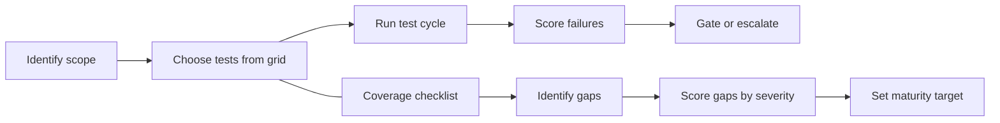

# Code domain

A markdown-first testing framework for source code, pull requests, services, and codebases. It tells you what to test, why it matters, and how severe a failure is. This is one domain within valid8 -- see the [repo root](../../README.md) for the domain-agnostic validation checklist this domain implements, defined at [`../../validation-dimensions.md`](../../validation-dimensions.md).

The repo is tool-agnostic and implementation-free. It defines the checks, not the code.

## Four questions this domain answers

**1. What should I test?**
Open [`grid/test-grid.md`](grid/test-grid.md). It is the master checklist -- every test category organized by lifecycle stage (planning, design, authoring, review, CI, pre-deployment, deployment, production) and severity tier. Filter it to the repositories and stages in scope for your project.

**2. How do I run the tests I've selected?**
This domain defines *what* each test checks and its acceptance condition -- it does not ship execution code. To run tests: implement each selected check using your own tooling (ESLint, SonarQube, Semgrep, Snyk, pytest-cov, k6, etc.), then follow [`process/test-cycle.md`](process/test-cycle.md) for the run lifecycle and failure behavior. [`process/tool-guidance.md`](process/tool-guidance.md) maps test categories to common tools.

**3. Where do I see test results?**
Record results in the format defined by [`grid/summary-test-grid.md`](grid/summary-test-grid.md) -- one row per test, with pass/fail, tier, and owner. Then surface the aggregated `gate_status` and `overall_score` using the dashboard spec in [`dashboards/README.md`](dashboards/README.md).

**4. How do I know if the results are acceptable?**
Use the scoring rubric at the bottom of this file. The short version: `READY` requires `pass_rate >= 95%` and zero Tier 1 failures. Any Tier 1 failure means `BLOCKED` -- the change should not merge or release until resolved. When a test fails, consult the remediation table in [`process/test-cycle.md`](process/test-cycle.md) for the likely cause and suggested fix.

---

## Where to start

**If you are an engineer or reviewer new to this domain:**

1. Read [`framework/README.md`](framework/README.md) to understand the severity tiers, the adversarial reliability standard, and the scoring model.
2. Open [`grid/test-grid.md`](grid/test-grid.md) -- this is the master checklist. Every test in the framework appears here with tier, threshold, owner, and catalog ID.
3. Use [`process/test-cycle.md`](process/test-cycle.md) as the step-by-step runbook when you run a test cycle.
4. When you need to understand what a specific test category covers in depth, navigate to the matching file in [`tests/`](tests/).
5. Read [`example-walkthrough.md`](example-walkthrough.md) for a fully worked example -- a solo builder validating an AI-assisted app before selling it, run through all 7 engagement phases end to end.

**If you are an AI agent generating, selecting, or executing tests (including as a code-review agent):**

1. [`grid/test-grid.md`](grid/test-grid.md) is the canonical checklist. Parse it for tier, quality characteristic, failure action, and catalog ID per test.
2. [`tests/`](tests/) contains structured test catalogs organized by domain. Each catalog has a consistent table with test ID, what it verifies, what failure it defends against, quality standards it maps to, and which lifecycle stage it belongs in.
3. [`framework/coverage-checklist.md`](framework/coverage-checklist.md) is the coverage self-assessment checklist listing all 124 test IDs across 8 domains. Use it to identify gaps.
4. [`process/tool-guidance.md`](process/tool-guidance.md) explains how to parse and use this repo programmatically.

---

## Repo structure

### Framework
Defines the standard, principles, and risk model.

| File | What it contains |
|---|---|
| `framework/README.md` | Severity tiers, adversarial reliability standard, 8-zone attack surface map, 4-factor severity scoring model |
| `framework/coverage-checklist.md` | Coverage evaluation checklist: 124 test IDs across 8 domains, ready to mark Covered / Partial / Gap |
| `framework/maturity-model.md` | Four-level maturity model (Reactive to Adversarial) with domain coverage matrix |

### Grid
The master test checklist and supporting reference tables.

| File | What it contains |
|---|---|
| `grid/test-grid.md` | Full test checklist with tier, acceptance threshold, tooling examples, owner, and lifecycle stage |
| `grid/summary-test-grid.md` | Run-level pass rate and gate status scorecard; dim_test schema; status value definitions |
| `grid/dim_test_template.csv` | Starter dim_test file -- copy and customize per project |
| `grid/result_log_template.csv` | Starter run log -- one row per test execution |
| `grid/summary_template.md` | Blank summary scorecard -- fill in after each run |
| `grid/raci-matrix.md` | Roles and accountability by test category |
| `grid/tier-dimension-reference.md` | Tier definitions and ISO/IEC 25010 quality characteristic glossary |
| `grid/standards-references.md` | Standards and sources the framework draws from |

### Test catalogs
Deep test definitions organized by domain. Each file has prose guidance followed by a structured catalog table.

| File | Domain | Catalog IDs |
|---|---|---|
| `tests/correctness-and-logic.md` | Edge cases, null handling, error propagation, algorithm fidelity, requirement validation | COR-001 to COR-014 |
| `tests/structure-and-style.md` | Readability, naming, complexity, duplication, dead code | STY-001 to STY-012 |
| `tests/security.md` | OWASP Top 10, CWE, secrets, access control, injection, SAST/DAST/SCA | SEC-001 to SEC-018 |
| `tests/architecture-and-design.md` | SOLID, coupling/cohesion, layering, API compatibility, threat modeling | ARC-001 to ARC-014 |
| `tests/testing-and-coverage.md` | Unit/integration/e2e, coverage, mutation testing, flakiness, usability, accessibility, UAT | TST-001 to TST-019 |
| `tests/performance-and-scalability.md` | Big-O, N+1 queries, memory, concurrency, caching | PERF-001 to PERF-012 |
| `tests/reliability-and-operability.md` | Error handling, retries, idempotency, deployment safety, RUM, synthetic monitoring | REL-001 to REL-020 |
| `tests/adversarial.md` | Fuzzing, supply-chain tampering, privilege escalation, chaos | ADV-001 to ADV-015 |

### Process
How to run a test cycle and build a test strategy.

| File | What it contains |
|---|---|
| `process/test-cycle.md` | Six-stage runbook from pre-commit to post-deploy monitoring |
| `process/testing-strategy.md` | How to build a project test plan; the 7-phase engagement methodology |
| `process/tool-guidance.md` | How humans and AI agents should navigate and use this repo; tool mapping by domain |

### Dimensions
Stage-specific testing guidance for each phase of the SDLC, from requirement to production.

| File | What it covers |
|---|---|
| `dimensions/planning-and-requirements.md` | Requirement clarity, edge-case identification, and testability before code is written |
| `dimensions/design-and-architecture.md` | Threat modeling and UI/UX usability testing on mockups and architecture before implementation |
| `dimensions/coding.md` | Code as it is written -- pre-commit, local checks, and secret detection |
| `dimensions/integration-and-testing.md` | Code under PR review, CI, and staging -- the full test pyramid, SAST/DAST/SCA, and non-functional test types |
| `dimensions/deployment.md` | Environment parity, config/secret validation, migration validation, smoke testing, rollback rehearsal |
| `dimensions/operations-and-maintenance.md` | Code running in production, kept by its original owner -- health checks, synthetic and real-user monitoring, long-term resource trends, A/B experiment integrity |
| `dimensions/handoff-and-transfer.md` | Ownership transfer to a new owner -- hallucinated dependencies, placeholder code, license/provenance review, handoff documentation, credential rotation |

### Dashboards
| File | What it contains |
|---|---|
| `dashboards/README.md` | Dashboard data model, build checklist, and gate behavior spec |

---

## How the framework fits together

The test grid and the coverage checklist work in parallel: the grid drives execution on each PR and release, the checklist drives the long-term question of whether the right tests exist at all.

---

## Validation dimensions coverage

This domain maps onto valid8's nine validation dimensions (see [`../../validation-dimensions.md`](../../validation-dimensions.md)) as follows:

| # | Dimension | Where it lives here | Status |
|---|---|---|---|
| 1 | Conformance | All eight test catalogs, mapped explicitly to OWASP, CWE, SOLID, Clean Code, ISO/IEC 25010, SemVer | Covered |
| 2 | Internal consistency | COR-011 (idempotent computation), PERF-010 (cache vs. source consistency), REL-014 (environment parity -- staging and production, two derivations of the same config source, checked for agreement), REL-015 (migration forward/rollback consistency), and the redundancy between unit/integration/e2e layers in `tests/testing-and-coverage.md` | Partial |
| 3 | Cross-validate | TST-016 (UAT / acceptance sign-off) is the closest real instance: an independent stakeholder, using a different method (using the product against acceptance criteria) than the one that produced it, confirms the outcome. PR review (`grid/raci-matrix.md`) is weaker -- the reviewer typically sees the author's diff and conclusion already. No dedicated dual-implementation or independent-oracle test catalog exists | Partial |
| 4 | Sensibility | `tests/structure-and-style.md` and `tests/architecture-and-design.md` (does this read sensibly to a knowledgeable reviewer), COR-013 (business rule fidelity), TST-014 (UI/UX usability testing directly asks whether the product makes sense to a real user) | Covered |
| 5 | Sensitivity | Touched by ADV-001 (fuzzing), COR-001 (boundary values), TST-005 (mutation testing), but none of these ask "how much does the conclusion change if a threshold or assumption changes" directly -- no dedicated sensitivity-analysis catalog | Gap |
| 6 | Robustness | `tests/performance-and-scalability.md` and `tests/reliability-and-operability.md` cover volume, concurrency, and repeated-application correctness directly; TST-019 (cross-browser/cross-device testing) extends this to "holds up as a blanket rule across the full supported environment matrix" | Covered |
| 7 | Durability | ARC-012 (API backward compatibility), `tests/structure-and-style.md` (maintainability for future readers), REL-011 (feature flag debt), REL-014/REL-015 (deployment-time checks that keep environments and schemas from drifting apart over time), and now REL-019 (handoff documentation sufficiency) -- a near-literal test of "does this hold up for a future maintainer," specifically one with zero prior context | Covered |
| 8 | Alignment | Reference principles are stated as prose in `framework/README.md`; `tests/architecture-and-design.md` operationalizes SOLID as checkable review items, and ARC-013 (threat modeling) adds a design-time check that architecture aligns with security principles before code exists; whether a change still serves the system's broader purpose remains a judgment call for most other cases, not a checkable test. Checked specifically against the new Handoff and Transfer IDs (SEC-017, SEC-018, ARC-014, REL-019, REL-020): these are legal, security, and operational risk checks, not tests of whether the system still serves its stated design purpose, so they don't move this verdict | Partial |
| 9 | Vantage | Five concrete, checkable lenses now exist: `tests/adversarial.md` (adversary), TST-016 (business stakeholder, via UAT sign-off), TST-017 (assistive-technology user, via accessibility testing), TST-018/TST-014 (global and general user, via localization and usability testing), and now a buyer/new-owner-with-zero-context lens and an auditor/legal-diligence lens from `dimensions/handoff-and-transfer.md` (REL-019 documentation sufficiency, REL-020 credential rotation, SEC-018 license compliance, ARC-014 provenance review). This is not a single systematic sweep of one change through every lens at once, but the lenses themselves are each backed by a real, checkable test rather than left as prose | Covered |

**A note on Internal consistency for code specifically:** the data domain's version of this dimension is "do two independent derivations of the same source agree" -- for example, a bottom-up and top-down aggregation of the same ledger. That concept does not map cleanly onto code. Code doesn't usually have two independent derivations of "the same answer" the way a dataset does. The closest analogs -- a cached value matching its source of truth, a function returning the same output for the same input, staging and production configuration agreeing, or a unit test and an integration test agreeing about the same behavior -- are real but noticeably thinner than the data domain's treatment. This is marked Partial rather than Covered specifically because it is a genuinely weaker fit for this domain, not because the catalog is incomplete.

**A note on the Cross-validate and Vantage revisions:** an earlier version of this table marked Cross-validate as a flat Gap and Vantage as Partial. Adding the Integration and Testing and Operations and Maintenance dimensions surfaced real test IDs (TST-016 UAT sign-off, TST-017 accessibility, TST-018 localization) that are genuine, if imperfect, instances of both dimensions -- an independent stakeholder confirming a result via a different method, and multiple named lenses each backed by a real check. Cross-validate moved from Gap to Partial; Vantage moved from Partial to Covered. Neither is as deep as the equivalent data-domain treatment, and both are logged as such rather than rounded up.

These gaps are logged, not fixed, by this table. Extending this domain to close them is a separate, deliberate decision.

## Why this domain exists

- Provide a repeatable, tool-neutral testing model for code review and software delivery.
- Make test coverage explicit across planning, design, authoring, review, CI, pre-deployment, deployment, and production.
- Keep the guidance in markdown so both people and AI code-review agents can navigate it.
- Avoid implementation details; focus on the test design, checklist, and outcomes.

## What this domain is good for

- building a project-specific code review and testing checklist
- mapping checks to severity tiers and ownership
- defining a merge gate and a release gate scorecard
- documenting security testing and architecture review expectations in one place
- capturing operational readiness, observability, and deployment-safety requirements

## What this domain does not include

- execution code, CI pipeline configuration, or linter/scanner rule sets themselves
- dashboard automation or UI testing scripts
- in-depth professional UX research, a full WCAG audit/certification, or professional translation QA -- this domain's usability (TST-014), accessibility (TST-017), and localization (TST-018) checks are baseline heuristic and automated checks, not a substitute for a dedicated UX, accessibility, or localization practice
- non-test documentation unrelated to code quality, security, or validation
- language- or framework-specific style guides -- this framework defines the checks, not a specific team's formatting rules

## Quick-start questions

- What repositories, services, or PRs are in scope?
- Which lifecycle stages must be tested: planning and requirements, design and architecture, coding, integration and testing, deployment, operations and maintenance?
- Which Tier 1 checks must block a merge or a release?
- Does this codebase have a security-sensitive surface (auth, payments, PII, a public API) that makes the Security and Adversarial domains mandatory rather than advisory?
- Who owns each test category and which support role (security champion, tech lead, SRE) is required?

## Scoring rubric

Use this rubric to score test success against all relevant checks and make gate decisions consistent.

- `total_tests` -- total number of checks executed.
- `pass_rate` -- `passed / total_tests`. `total_tests` counts only the checks executed in this run -- tests scoped out of the project do not factor in.
- `tier1_failures` -- count of Tier 1 failures.
- `tier2_warnings` -- count of Tier 2 review flags or warnings.
- `tier3_issues` -- count of monitored tech-debt or drift alerts.
- `overall_score` -- weighted score based on tier severity. See formula below.

### Example scoring formula

- Tier 1 pass = 5 points
- Tier 2 pass = 2 points
- Tier 3 pass = 1 point
- Tier 1 fail = 0 points
- Tier 2 warning = 1 point
- Tier 3 issue = 0 points

`overall_score = (tier1_pass*5 + tier2_pass*2 + tier3_pass*1) / maximum_possible_score`

`maximum_possible_score` is the sum of tier weights for all tests in the project's scoped test list -- not just the tests that ran in this cycle, and not the full master grid. Tests explicitly scoped out of the project do not count toward the denominator.

### Recommended thresholds

- `READY` if `pass_rate >= 95%` and `tier1_failures == 0`
- `REVIEW` if `pass_rate >= 80%` and `tier1_failures == 0`
- `BLOCKED` if `tier1_failures > 0`

### What it means

- `READY` means the change is acceptable to merge and release with no critical quality or security issues. Example: a Tier 1 vulnerability scan is clean, the build passes, and coverage thresholds are met.
- `REVIEW` means the change is acceptable to merge under supervision, but Tier 2 or Tier 3 concerns exist (a coverage warning, a maintainability flag). Example: a required-fix-before-release warning is open but does not block the merge itself.
- `BLOCKED` means the change should not merge or the release should not ship until Tier 1 failures are resolved. Example: a critical/high dependency vulnerability, a broken build, or a failing Tier 1 correctness test.

### Practical use

- Calculate the rubric in the CI pipeline output or the dashboard.
- Surface `gate_status` and `overall_score` to engineering leadership and stakeholders.
- Use the rubric to compare PRs, releases, or repositories and prioritize fixes.

## Notes

This domain is intentionally written for easy extension. Add new test categories, new example rows, or new governance checks in markdown without changing its structure.
