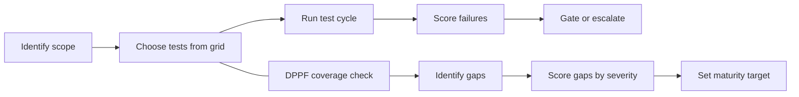

# Data domain

A markdown-first testing framework for data pipelines, analytics datasets, and data products. It tells you what to test, why it matters, and how severe a failure is. This is one domain within valid8 -- see the [repo root](../../README.md) for the domain-agnostic validation checklist this domain implements.

The repo is tool-agnostic and implementation-free. It defines the checks, not the code.

## Four questions this domain answers

**1. What should I test?**
Open [`grid/test-grid.md`](grid/test-grid.md). It is the master checklist -- every test category organized by lifecycle stage (ingestion, processing, final output) and severity tier. Filter it to the datasets and stages in scope for your project.

**2. How do I run the tests I've selected?**
This domain defines *what* each test checks and its acceptance condition -- it does not ship execution code. To run tests: implement each selected check using your own tooling (SQL, dbt, Great Expectations, pandas, etc.), then follow [`process/test-cycle.md`](process/test-cycle.md) for the run lifecycle and failure behavior. [`process/tool-guidance.md`](process/tool-guidance.md) maps test categories to common tools.

**3. Where do I see test results?**
Record results in the format defined by [`grid/summary-test-grid.md`](grid/summary-test-grid.md) -- one row per test, with pass/fail, tier, and owner. Then surface the aggregated `gate_status` and `overall_score` using the dashboard spec in [`dashboards/README.md`](dashboards/README.md).

**4. How do I know if the results are acceptable?**
Use the scoring rubric at the bottom of this file. The short version: `READY` requires `pass_rate >= 95%` and zero Tier 1 failures. Any Tier 1 failure means `BLOCKED` -- the pipeline should not promote until resolved. When a test fails, consult the remediation table in [`process/test-cycle.md`](process/test-cycle.md) for the likely cause and suggested fix.

---

## Where to start

**If you are a data engineer or analyst new to this domain:**

1. Read [`framework/README.md`](framework/README.md) to understand the severity tiers, the adversarial reliability standard, and the scoring model.
2. Open [`grid/test-grid.md`](grid/test-grid.md) -- this is the master checklist. Every test in the framework appears here with tier, threshold, owner, and DPPF ID.
3. Use [`process/test-cycle.md`](process/test-cycle.md) as the step-by-step runbook when you run a test cycle.
4. When you need to understand what a specific test category covers in depth, navigate to the matching file in [`tests/`](tests/).
5. Read [`example-walkthrough.md`](example-walkthrough.md) for a fully worked example -- a real three-entity monthly revenue consolidation, scoped, run, scored, and gated end to end.

**If you are an AI agent generating, selecting, or executing tests:**

1. [`grid/test-grid.md`](grid/test-grid.md) is the canonical checklist. Parse it for tier, DAMA dimension, failure action, and DPPF ID per test.
2. [`tests/`](tests/) contains structured test catalogs organized by domain. Each catalog has a consistent table with test ID, what it verifies, what failure it defends against, quality standards it maps to, and which lifecycle stage it belongs in.
3. [`framework/dppf.md`](framework/dppf.md) is the coverage self-assessment checklist listing all 113 test IDs across 8 domains. Use it to identify gaps.
4. [`process/tool-guidance.md`](process/tool-guidance.md) explains how to parse and use this repo programmatically.

---

## Repo structure

### Framework
Defines the standard, principles, and risk model.

| File | What it contains |
|---|---|
| `framework/README.md` | Severity tiers, adversarial reliability standard, 8-zone attack surface map, DPPF 4-factor scoring model |
| `framework/dppf.md` | Coverage evaluation checklist: 113 test IDs across 8 domains, ready to mark Covered / Partial / Gap |
| `framework/maturity-model.md` | Four-level maturity model (Reactive to Adversarial) with domain coverage matrix |

### Grid
The master test checklist and supporting reference tables.

| File | What it contains |
|---|---|
| `grid/test-grid.md` | Full test checklist with tier, DAMA dimension, thresholds, tooling, owner, and DPPF IDs |
| `grid/summary-test-grid.md` | Run-level pass rate and gate status scorecard; dim_test schema; status value definitions |
| `grid/dim_test_template.csv` | Starter dim_test file -- copy and customize per project |
| `grid/result_log_template.csv` | Starter run log -- one row per test execution |
| `grid/summary_template.md` | Blank summary scorecard -- fill in after each run |
| `grid/lineage-map.md` | End-to-end lineage diagram, zone-to-zone validation table, lineage coverage checklist |
| `grid/raci-matrix.md` | Roles and accountability by test category |
| `grid/tier-dimension-reference.md` | Tier definitions and DAMA dimension glossary |
| `grid/standards-references.md` | Standards and sources the framework draws from |

### Test catalogs
Deep test definitions organized by domain. Each file has prose guidance followed by a structured DPPF test catalog table.

| File | Domain | DPPF IDs |
|---|---|---|
| `tests/schema-and-types.md` | Structural: schema, types, contracts, evolution, contract design review | STR-001 to STR-016 |
| `tests/integrity-and-references.md` | Semantic: business rules, referential integrity, reconciliation | SEM-001 to SEM-015 |
| `tests/anomaly-and-drift.md` | Statistical: distributions, drift, volume, anomalies | STAT-001 to STAT-015 |
| `tests/performance-and-freshness.md` | Temporal and performance: freshness, latency, ordering, throughput, degradation, cost | TMP-001 to TMP-014, PERF-001 to PERF-012 |
| `tests/observability-and-operations.md` | Operational: idempotency, retries, backfill, lineage, pipeline cutover | OPS-001 to OPS-016 |
| `tests/adversarial.md` | Adversarial: fault injection, chaos, poisoned input, replay | ADV-001 to ADV-015 |
| `tests/cross-validation-suite.md` | Internal-consistency (same-source reconciliation) and sensibility analysis | SEN-001 to SEN-010 |
| `tests/quality-and-completeness.md` | Completeness: nulls, record coverage, valid values | See STR-003, SEM-011 |
| `tests/metadata-and-governance.md` | Governance: lineage, ownership, data standards | See OPS-011, OPS-012 |
| `tests/security-and-privacy.md` | Security: masking, access control, compliance | See ADV-006, OPS-012 |
| `tests/real-world-patterns.md` | Practical test patterns mapped to the catalog | Cross-domain |

### Process
How to run a test cycle and build a test strategy.

| File | What it contains |
|---|---|
| `process/test-cycle.md` | Eight-step runbook from schema check to log and sign-off |
| `process/testing-strategy.md` | How to build a project test plan; the 7-phase DPPF engagement methodology |
| `process/tool-guidance.md` | How humans and AI agents should navigate and use this repo |

### Dimensions
Stage-specific testing guidance for each phase of the pipeline.

| File | What it covers |
|---|---|
| `dimensions/design-and-contracts.md` | Schema and data-contract design review before a pipeline exists |
| `dimensions/raw-data.md` | Source and ingestion layer testing |
| `dimensions/processing.md` | Transformation, enrichment, and orchestration testing |
| `dimensions/final-data.md` | Delivered datasets, exports, and analytics-ready output |
| `dimensions/deployment-and-cutover.md` | Pipeline replacement: historical migration and old-versus-new parity before decommissioning |

### Dashboards
| File | What it contains |
|---|---|
| `dashboards/README.md` | Dashboard data model, build checklist, and gate behavior spec |

---

## How the framework fits together

The test grid and the DPPF coverage checklist work in parallel: the grid drives execution on each run, the checklist drives the long-term question of whether the right tests exist at all.

---

## Validation dimensions coverage

This domain maps onto valid8's nine validation dimensions (see [`../../validation-dimensions.md`](../../validation-dimensions.md)) as follows:

| # | Dimension | Where it lives here | Status |
|---|---|---|---|
| 1 | Conformance | Structural, Semantic, Temporal, Operational, Adversarial, Performance test files | Covered |
| 2 | Internal consistency | `tests/cross-validation-suite.md`, "mechanical cross-validation" section | Covered |
| 3 | Cross-validate | OPS-016 (pipeline cutover parity) is a genuine instance: the old pipeline, built independently and not built to confirm the new one's conclusion, is compared against it before decommissioning. `grid/standards-references.md` benchmarks the framework itself but that's not per-result. No dual-implementation or independent-oracle catalog exists outside the cutover case | Partial |
| 4 | Sensibility | `tests/cross-validation-suite.md`, "sensibility analysis" section, SEN-001 to SEN-010 | Covered |
| 5 | Sensitivity | Touched by STAT-004/010 and SEN-003, no dedicated catalog | Gap |
| 6 | Robustness | `tests/performance-and-freshness.md`, PERF-001 to PERF-012 cover technical scale; policy-scale ("blanket rule") untested. STR-016 and OPS-016 are one-time design/cutover gates, not repeated-at-volume checks, so they don't change this verdict | Partial |
| 7 | Durability | `grid/lineage-map.md`, ADV-006, OPS-011, and now OPS-016 (cutover parity keeps downstream consumers on continuous, reconciled output across a pipeline replacement) and STR-016 (a contract designed for reconciliation up front is more likely to survive a future maintainer's changes) | Covered |
| 8 | Alignment | Framework purpose statement and DAMA-DMBOK principles, stated as prose, not checkable tests | Partial |
| 9 | Vantage | `grid/raci-matrix.md` assigns accountability by role, but doesn't sweep a result through multiple perspectives | Gap |

**A note on the Cross-validate revision:** an earlier version of this table marked Cross-validate as a flat Gap. Adding `dimensions/deployment-and-cutover.md` and OPS-016 surfaced a genuine instance -- a pipeline cutover parity check compares two independently built pipelines, and the old one was never built to confirm the new one's conclusion. That is real cross-validation, not internal consistency (which would be two derivations of the same pipeline agreeing with itself). It moved from Gap to Partial rather than Covered because it only applies at cutover, not to every result the pipeline produces.

These gaps are logged, not fixed, by this table. Extending this domain to close them is a separate, deliberate decision.

## Why this domain exists

- Provide a repeatable, domain-neutral testing model for data projects.
- Make test coverage explicit across ingestion, processing, output, validation, and operations.
- Keep the guidance in markdown so both people and automation can navigate it.
- Avoid implementation details; focus on the test design, checklist, and outcomes.

## What this domain is good for

- building a project-specific data testing checklist
- mapping tests to severity tiers and ownership
- defining a summary gate and pass-rate scorecard
- documenting cross-validation and anomaly detection behavior
- capturing operational readiness and observability requirements

## What this domain does not include

- execution code or test harnesses
- dashboard automation or UI testing scripts
- production application logic
- non-test documentation unrelated to data quality or validation

## Quick-start questions

- What data artifacts are in scope?
- Which lifecycle stages must be tested: ingestion, processing, final output?
- Which Tier 1 checks must block the pipeline?
- Which cross-validation and anomaly detection rules should prevent silent failures?
- Who owns each test category and which support role is required?

## Scoring rubric

Use this rubric to score test success against all relevant checks and make gate decisions consistent.

- `total_tests` -- total number of checks executed.
- `pass_rate` -- `passed / total_tests`. `total_tests` counts only the checks executed in this run -- tests scoped out of the project do not factor in.
- `tier1_failures` -- count of Tier 1 failures.
- `tier2_warnings` -- count of Tier 2 review flags or warnings.
- `tier3_issues` -- count of monitored drift or anomaly alerts.
- `overall_score` -- weighted score based on tier severity. See formula below.

### Example scoring formula

- Tier 1 pass = 5 points
- Tier 2 pass = 2 points
- Tier 3 pass = 1 point
- Tier 1 fail = 0 points
- Tier 2 warning = 1 point
- Tier 3 issue = 0 points

`overall_score = (tier1_pass*5 + tier2_pass*2 + tier3_pass*1) / maximum_possible_score`

`maximum_possible_score` is the sum of tier weights for all tests in the project's scoped test list -- not just the tests that ran in this cycle, and not the full master grid. Tests explicitly scoped out of the project do not count toward the denominator.

### Recommended thresholds

- `READY` if `pass_rate >= 95%` and `tier1_failures == 0`
- `REVIEW` if `pass_rate >= 80%` and `tier1_failures == 0`
- `BLOCKED` if `tier1_failures > 0`

### What it means

- `READY` means the run is acceptable for release with no critical quality issues.
- `REVIEW` means the run is acceptable under supervision, but Tier 2 or Tier 3 concerns exist.
- `BLOCKED` means the pipeline should not promote artifacts until Tier 1 failures are resolved.

### Practical use

- Calculate the rubric in the dashboard or results table.
- Surface `gate_status` and `overall_score` to stakeholders.
- Use the rubric to compare runs and prioritize fixes.

## Notes

This domain is intentionally written for easy extension. Add new test categories, new example rows, or new governance checks in markdown without changing its structure.
